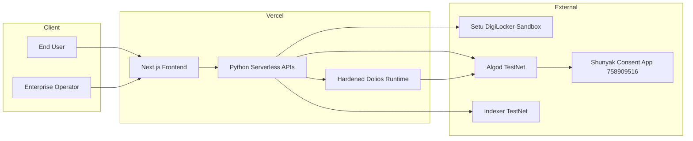
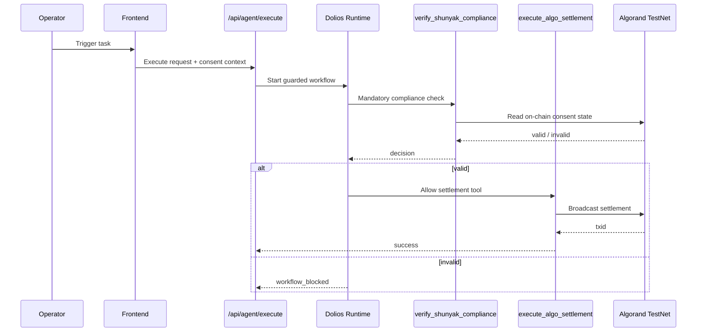

# Shunyak Protocol

**Consent-gated AI execution on Algorand for DPDP-aligned workflows.**

Shunyak Protocol enforces a hard runtime invariant: autonomous agent execution is blocked unless user consent is verifiably valid on-chain.

## Why Shunyak Exists

Most agent stacks still depend on weak controls:
- prompt-only compliance instructions
- audit-after-the-fact approaches
- centralized consent stores

Shunyak moves consent enforcement into infrastructure. If consent is missing, expired, or revoked, settlement paths do not execute.

## What Is Included

- Next.js 16 frontend with demo routes: `/consent`, `/blocked`, `/authorized`, `/showcase`
- Python serverless API layer for consent lifecycle, execution, stream, audit, and showcase endpoints
- Algorand consent smart contract with `register_consent`, `revoke_consent`, `check_status`
- Hardened Dolios runtime integration with workflow ordering, credential boundary injection, DLP checks, and append-only audit events
- Vercel-ready deployment model for frontend + Python APIs

## Verified TestNet Snapshot

Last verified: 2026-04-16

| Field | Value |
| --- | --- |
| Network | Algorand TestNet |
| App ID | `758909516` |
| App Address | `MBC3GSLWOUXTW7EPC4X5AOA2WFSLUEGLNKHHMQ3YEM3SZ4QF2OIXXBI2YE` |
| Registrar / Sender | `SHYFV65OX2KCXPFBKZBZNSYL6RE4PFAWHVWL2RIAR4QMULX7FS3NJJ7CFU` |
| Deploy Txid | `37V5ZNDZ4EJUNPJCVQEEUEGBTKWNFGWK5NWLVTGKSJ62SR6PHI5A` |
| Algod | `https://testnet-api.algonode.cloud` |
| Indexer | `https://testnet-idx.algonode.cloud` |

Source: `contracts/artifacts/deployment-result.json`

## Architecture

### System Context



Text alternative:
- Client requests go to Vercel-hosted frontend and APIs.
- APIs coordinate DigiLocker checks, runtime orchestration, and chain calls.
- Consent status is anchored in Algorand app box storage.

### Guardrail Execution Path



Text alternative:
- The agent cannot call settlement before compliance verification.
- Invalid consent always returns a blocked path.
- Valid consent unlocks settlement broadcast.

For full architecture and trust-boundary docs: `docs/architecture.md`.

## Demo Walkthrough

1. `/consent` - register consent and anchor metadata on-chain
2. `/blocked` - run execution for missing consent and observe policy block
3. `/authorized` - run execution with valid consent and observe settlement path
4. `/showcase` - inspect runtime, app, chain, and readiness telemetry

## Repository Layout

```text
shunyak-protocol/
├── frontend/                 # Next.js app
├── api/                      # Python serverless APIs
├── contracts/                # Algorand contract + deploy
├── agent/                    # Dolios runtime integration and tools
├── docs/                     # Architecture, deployment, diagram guides
├── policies/                 # Workflow and execution policy config
└── tests/                    # Integration and behavior tests
```

## Local Development

```bash
cd frontend && npm install
cd ..
python3 -m venv .venv
source .venv/bin/activate
pip install -r requirements.txt
cp .env.example .env
./scripts/dev-local.sh
```

Run tests:

```bash
.venv/bin/python -m pytest -c pytest.ini -q
```

## Deployment (Summary)

1. Deploy contract:

```bash
source .venv/bin/activate
export SHUNYAK_DEPLOYER_MNEMONIC="<funded mnemonic>"
export SHUNYAK_CONSENT_REGISTRAR_MNEMONIC="<funded mnemonic>"
python contracts/deploy.py --output-dir contracts/artifacts
```

2. Configure Vercel env vars (`SHUNYAK_APP_ID`, mnemonics, secrets, runtime toggles).
3. Deploy runtime:

```bash
vercel deploy --yes
vercel deploy --prod --yes
```

Complete runbook: `docs/deployment.md`

## Security Model

Primary controls:
- workflow DAG enforces compliance-before-settlement
- credential boundary injection keeps signing keys out of model context
- DLP scanning runs before sensitive tool invocation
- signed stream and consent token controls reduce request drift
- registrar-gated on-chain mutation path

Hardening details: `HARDENED.md`

## Security Validation Workflow

Run the repeatable security scan suite:

```bash
./scripts/run-security-scans.sh
```

This generates local reports under `security-reports/` (ignored from git) and runs:
- Bandit (Python static security checks)
- pip-audit (Python dependency vulnerabilities)
- npm audit (frontend dependency vulnerabilities)
- detect-secrets (tracked-files secret leakage checks)
- Semgrep OWASP and Semgrep secrets rule packs

## Documentation

- `docs/README.md` - documentation index and reading paths
- `docs/architecture.md` - full architecture and trust boundaries
- `docs/well-architected-checklist.md` - release-quality architecture checklist
- `docs/deployment.md` - deployment and operations runbook
- `docs/testnet-deployment.md` - verified chain snapshot
- `docs/diagrams/README.md` - diagram inventory and validation policy
- `docs/diagrams/shunyak-system-context.html` - presentation architecture diagram
- `docs/diagrams/shunyak-consent-flow.html` - consent registration flow diagram
- `docs/diagrams/shunyak-guardrail-flow.html` - guarded execution flow diagram
- `PRD.md` and `SPEC.md` - product and technical requirements

## Community and Governance

- `CONTRIBUTING.md`
- `SECURITY.md`
- `CODE_OF_CONDUCT.md`
- `.github/workflows/ci.yml`

## External References

- AlgoKit: https://developer.algorand.org/docs/get-started/algokit
- Vercel deployment docs: https://vercel.com/docs/deployments/overview
