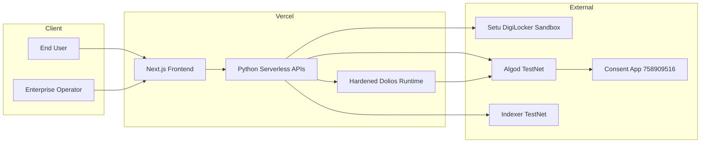
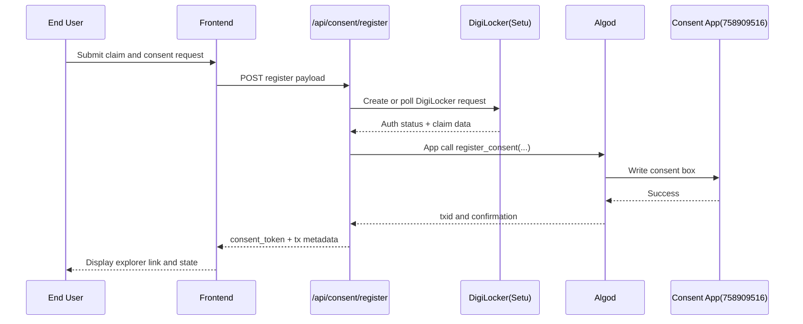
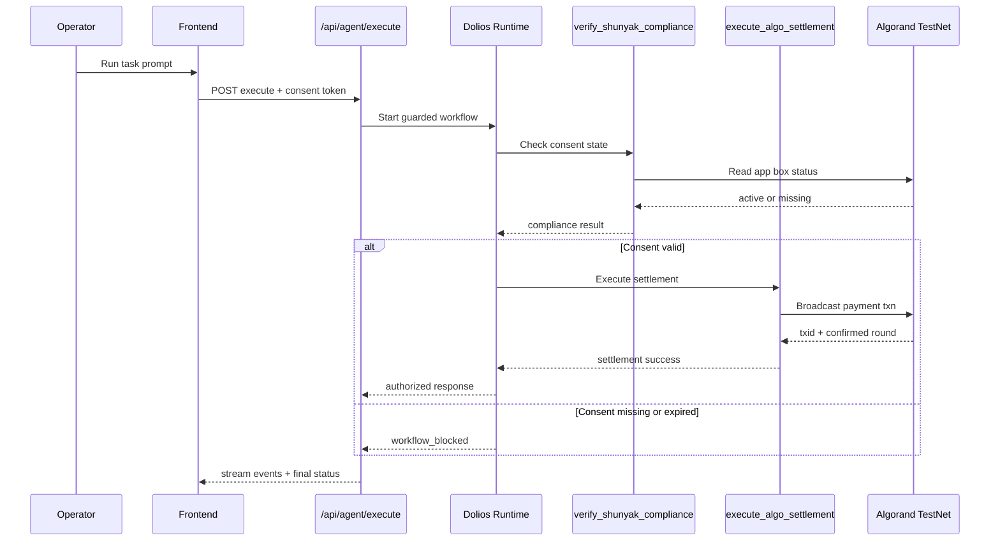
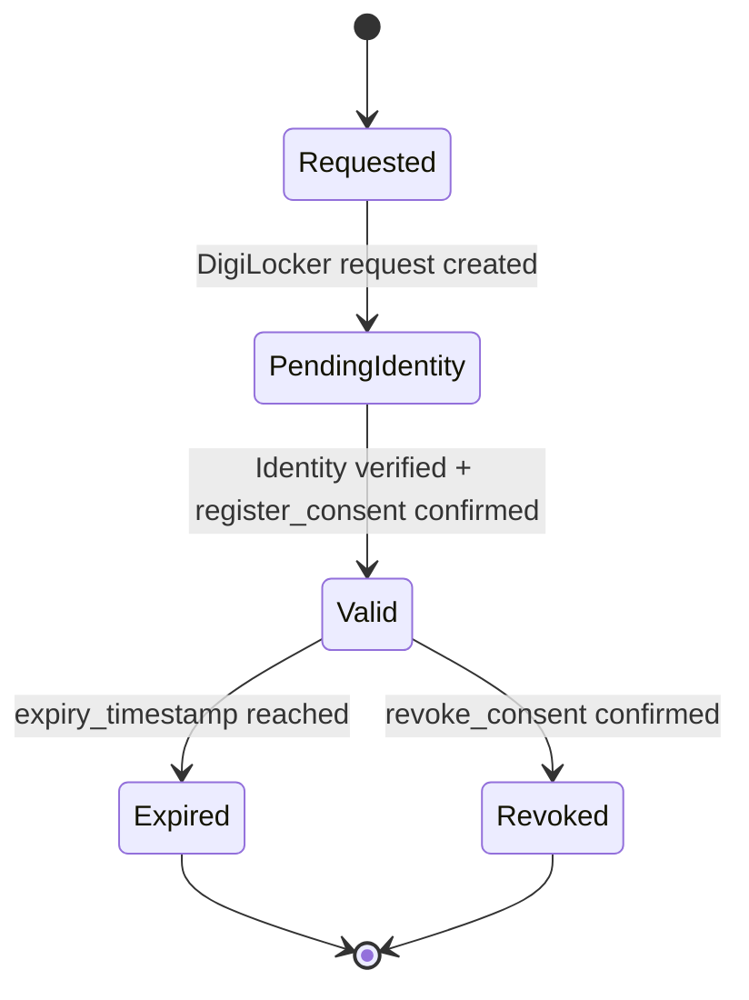
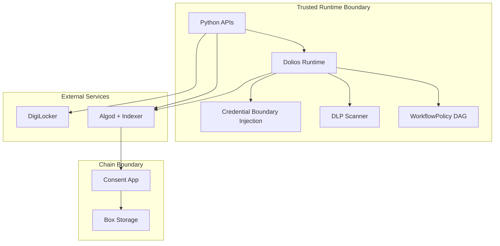

# Shunyak Protocol Architecture

Last updated: 2026-04-16

This document describes runtime topology, trust boundaries, consent lifecycle, and guarded execution flows for Shunyak Protocol.

## 1. System Context

Text alternative:
- Users and operators interact with a Vercel-hosted frontend.
- Frontend calls Python serverless APIs for consent, execution, and telemetry.
- API and runtime integrate with DigiLocker, Algod, and Indexer.
- Consent status is persisted in Algorand app box storage.
- Settlement paths are unlocked only after compliance checks pass.

## 2. Runtime Components

| Component | Location | Responsibility |
| --- | --- | --- |
| Next.js frontend | `frontend/` | UI flows (`/consent`, `/blocked`, `/authorized`, `/showcase`) |
| Consent APIs | `api/consent/*.py` | Register, status-check, and revoke consent |
| Agent APIs | `api/agent/*.py` | Guarded execution and SSE streaming |
| Audit API | `api/audit/log.py` | Exposes structured runtime audit events |
| Showcase API | `api/algorand/showcase.py` | Runtime and chain visibility for demo verification |
| Contract | `contracts/shunyak_consent.py` | On-chain consent state in box storage |
| Deploy script | `contracts/deploy.py` | Contract deployment + deployment metadata output |
| Agent runtime | `agent/` | Workflow policy, DLP checks, settlement tool execution |

## 3. Consent Registration Flow

Text alternative:
- Frontend submits claim, provider, and proof payload to `/api/consent/register`.
- API resolves DigiLocker status and validates AlgoPlonk payload shape (and optional verifier app call).
- API performs on-chain app-call consent registration.
- Contract writes or updates the consent box.
- API returns tokenized consent context and transaction metadata to frontend.

## 4. Guarded Agent Execution Flow

Text alternative:
- Operator triggers execution from frontend.
- API starts the agent runtime with workflow policy enforcement.
- Agent must run compliance verification before settlement.
- If consent is valid, settlement is broadcast and tx metadata is returned.
- If consent is missing or expired, workflow is blocked and logged.

## 5. Consent State Lifecycle

Text alternative:
- Consent begins in requested/pending identity states.
- After successful identity/proof checks and on-chain write, consent becomes valid.
- Valid consent transitions to expired by time or revoked by explicit app-call.

## 6. Trust Boundary View

Text alternative:
- Runtime controls (workflow, DLP, credential boundaries) are enforced before sensitive actions.
- Chain reads/writes cross the RPC boundary into Algorand app and box storage.
- DigiLocker remains an external identity signal source and never replaces on-chain consent checks.

## 7. Contract Data Model and Methods

Box key derivation:

`SHA256(user_pubkey + enterprise_pubkey + app_id.to_bytes(8, "big"))`

Box value schema (64 bytes):
- bytes `[0:32]`: `consent_hash`
- bytes `[32:40]`: `expiry_timestamp` (uint64)
- byte `[40:41]`: `consent_version`
- bytes `[41:64]`: reserved

Contract methods:
- `register_consent(byte[],byte[],byte[],byte[],uint64)void`
- `revoke_consent(byte[],byte[])void`
- `check_status(byte[],byte[])(bool,uint64)`

## 8. Trust Boundaries and Security Controls

Primary controls in the current deployment:
- Workflow policy DAG blocks settlement unless compliance check succeeded.
- Credential vault boundary injection keeps signing material out of LLM context.
- DLP argument scanning runs before sensitive tool dispatch.
- Signed consent tokens and stream tickets reduce cross-instance authorization drift.
- Registrar-gated app-call writes enforce contract-level authority.
- Optional strict verifier mode enforces on-chain AlgoPlonk app-call success.

See also:
- `HARDENED.md`
- `docs/security-audit-remediation-2026-04-16.md`

## 9. Known Runtime Constraints

- Vercel serverless runtime has execution time limits; the demo keeps execution loops bounded.
- TestNet funding constraints can affect settlement success; signer and app balances should be validated before demos.
- DigiLocker and testnet RPC availability can impact live demos; use smoke checks before recording.

## 10. Presentation Diagrams (HTML)

- `docs/diagrams/shunyak-system-context.html`
- `docs/diagrams/shunyak-consent-flow.html`
- `docs/diagrams/shunyak-guardrail-flow.html`
