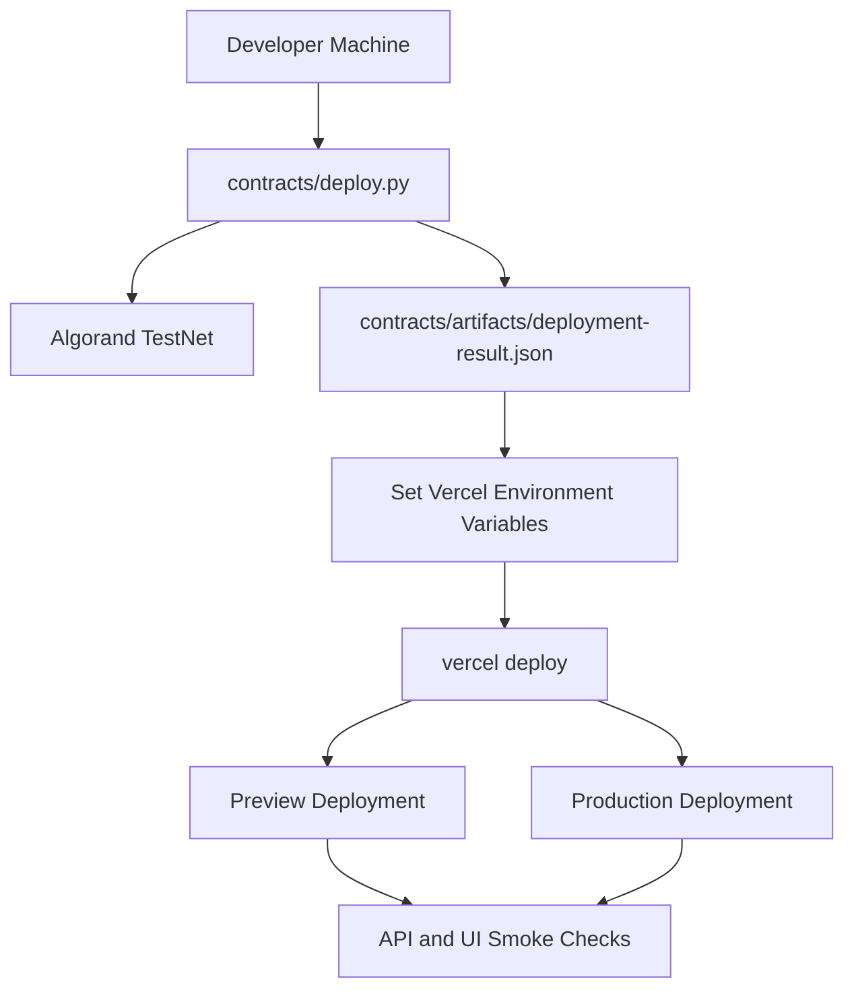

# Deployment Guide (Vercel + Algorand TestNet)

Last updated: 2026-04-16

This runbook covers contract deployment, runtime configuration, deployment verification, and recovery patterns for Shunyak Protocol.

## 1. Deployment Topology



Text alternative:
- Deploy contract first and capture emitted metadata.
- Use emitted values to configure runtime environment variables.
- Deploy preview and production runtimes, then execute smoke checks.

## 2. Prerequisites

- Node.js 20+ and npm
- Python 3.11+ with virtual environment
- AlgoKit CLI
- Vercel CLI (authenticated)
- Funded Algorand TestNet accounts for deployer and registrar

Bootstrap local tools:

```bash
cd frontend && npm install
cd ..
python3 -m venv .venv
source .venv/bin/activate
pip install -r requirements.txt
```

## 3. Reference TestNet Snapshot

| Field | Value |
| --- | --- |
| App ID | `758909516` |
| App Address | `MBC3GSLWOUXTW7EPC4X5AOA2WFSLUEGLNKHHMQ3YEM3SZ4QF2OIXXBI2YE` |
| Registrar / Sender | `SHYFV65OX2KCXPFBKZBZNSYL6RE4PFAWHVWL2RIAR4QMULX7FS3NJJ7CFU` |
| Deploy Txid | `37V5ZNDZ4EJUNPJCVQEEUEGBTKWNFGWK5NWLVTGKSJ62SR6PHI5A` |
| Algod | `https://testnet-api.algonode.cloud` |
| Indexer | `https://testnet-idx.algonode.cloud` |

References:
- `contracts/artifacts/deployment-result.json`
- `docs/testnet-deployment.md`

## 4. Deploy Contract

### 4.1 Optional artifacts-only run

```bash
source .venv/bin/activate
python contracts/deploy.py --write-artifacts-only
```

### 4.2 Full deploy to TestNet

```bash
source .venv/bin/activate
export SHUNYAK_DEPLOYER_MNEMONIC="<funded 25-word mnemonic>"
export SHUNYAK_CONSENT_REGISTRAR_MNEMONIC="<funded 25-word mnemonic>"
python contracts/deploy.py --output-dir contracts/artifacts
```

Extract emitted values:

```bash
jq -r '.app_id, .app_address, .registrar_address, .txid' contracts/artifacts/deployment-result.json
```

## 5. Configure Vercel Runtime

Link project:

```bash
vercel whoami
vercel link
```

### 5.1 Required variables

| Variable | Notes |
| --- | --- |
| `SHUNYAK_APP_ID` | Consent app ID from deployment artifact |
| `SHUNYAK_CONSENT_SOURCE` | `hybrid` recommended |
| `SHUNYAK_IDENTITY_PROVIDER` | `digilocker` |
| `SHUNYAK_ZK_BACKEND` | `algoplonk` |
| `ALGOD_SERVER` | `https://testnet-api.algonode.cloud` |
| `INDEXER_SERVER` | `https://testnet-idx.algonode.cloud` |
| `SHUNYAK_ENABLE_TESTNET_TX` | `true` |
| `SHUNYAK_DEMO_SECRET` | high-entropy value |
| `SHUNYAK_STREAM_TICKET_SECRET` | high-entropy value |
| `SHUNYAK_AGENT_MNEMONIC` | funded signer |
| `SHUNYAK_CONSENT_REGISTRAR_MNEMONIC` | registrar authority |

### 5.2 Recommended hardening variables

- `SHUNYAK_REQUIRE_OPERATOR_AUTH=true`
- `SHUNYAK_OPERATOR_TOKEN=<secret>`
- `SHUNYAK_REQUIRE_EXECUTION_TOKEN=true`
- `SHUNYAK_ALLOWED_ORIGINS=<comma-separated exact origins>`
- `SHUNYAK_SETTLEMENT_ALLOW_MOCK_FALLBACK=false`
- `SHUNYAK_REQUIRE_HARDENED=true`

### 5.3 Identity and verifier variables

- `SHUNYAK_DIGILOCKER_CLIENT_ID`
- `SHUNYAK_DIGILOCKER_CLIENT_SECRET`
- `SHUNYAK_DIGILOCKER_PRODUCT_INSTANCE_ID`
- `SHUNYAK_DIGILOCKER_REDIRECT_URL`
- `SHUNYAK_ALGOPLONK_VERIFY_APP_ID` (optional)
- `SHUNYAK_ALGOPLONK_REQUIRE_ONCHAIN_VERIFY=true` (strict mode)

Set env values by CLI (example):

```bash
vercel env add SHUNYAK_APP_ID preview
vercel env add SHUNYAK_APP_ID production
vercel env add SHUNYAK_AGENT_MNEMONIC preview
vercel env add SHUNYAK_AGENT_MNEMONIC production
```

## 6. Deploy Runtime

Preview:

```bash
vercel deploy --yes
```

Production:

```bash
vercel deploy --prod --yes
```

## 7. Post-Deploy Validation

### 7.1 API checks

```bash
curl -sS https://<your-domain>/api/algorand/showcase | jq .ok
curl -sS "https://<your-domain>/api/consent/status?user_pubkey=<PUBKEY>&enterprise_pubkey=<PUBKEY>" | jq .
```

### 7.2 UI checks

- `/consent`: consent registration returns expected chain metadata
- `/blocked`: missing consent yields workflow-blocked path
- `/authorized`: valid consent yields settlement path
- `/showcase`: app/runtime mode and signer readiness fields are present

## 8. Troubleshooting Matrix

| Symptom | Likely Cause | Action |
| --- | --- | --- |
| `SHUNYAK_APP_ID must be configured` | missing env var | set env var in target environment and redeploy |
| consent registers but execute blocks unexpectedly | source mismatch or expired consent | verify consent source config and expiry status |
| settlement failure | signer balance or recipient invalid | fund signer, validate addresses, retry |
| stream endpoint intermittency | stream secrets or clock skew | validate secrets and synchronized system time |
| DigiLocker request never resolves | credential/config mismatch | verify Setu sandbox creds and request-id reuse |

## 9. Rollback and Change Control

- Roll back runtime by promoting a prior healthy Vercel deployment.
- Treat each app ID as immutable for a deployment cycle.
- On contract redeploy:
  1. update `contracts/artifacts/deployment-result.json`
  2. update `docs/testnet-deployment.md`
  3. update `SHUNYAK_APP_ID` in Vercel
  4. rerun smoke checks
