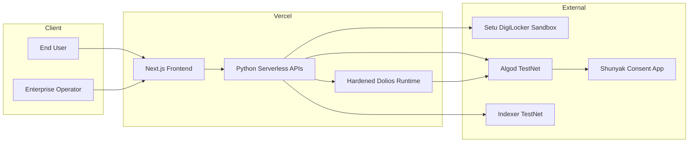
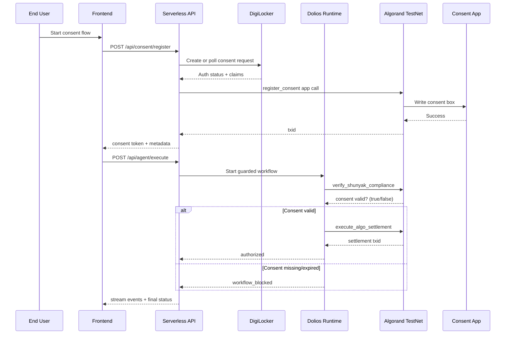

# Shunyak Protocol - DoraHacks BUIDL Description

## One-line Pitch

**Shunyak Protocol is a consent-gated AI execution layer on Algorand that makes autonomous agents technically unable to process personal data or move funds unless user consent is cryptographically verifiable on-chain.**

---

## Vision

AI agents should not be trusted to "remember compliance."  
They should be **architecturally constrained** to enforce it.

Shunyak's vision is to become the trust rail for agentic systems in regulated markets: a system where every high-risk action (data processing, financial settlement) is conditioned on verifiable, revocable, and auditable user consent.

---

## The Problem We Solve

Under India's DPDP Act, enterprises cannot legally process personal data without valid, purpose-limited consent.  
In practice, agent systems still rely on weak patterns:

- Prompt-level "please check consent" instructions
- Audit-after-the-fact logs
- Centralized consent stores that create breach honeypots

These approaches fail exactly where enforcement is needed most.

**Shunyak flips this model:** consent is enforced in the execution path itself, not in policy docs or prompts.

---

## What We Built (Hackathon MVP)

Shunyak is a full-stack demo on **Vercel + Algorand TestNet** with real consent and execution paths:

1. **Consent Registration**
   - DigiLocker (Setu sandbox) flow for identity-backed consent intent
   - AlgoPlonk payload ingestion with optional on-chain verification
   - Consent anchored into Algorand app box storage

2. **Compliance-Gated Agent Execution**
   - A hardened Dolios runtime enforces workflow ordering
   - `verify_shunyak_compliance` must succeed before settlement can run
   - Missing or expired consent produces a deterministic blocked outcome

3. **Authorized Settlement Path**
   - For valid consent, settlement is signed and broadcast to Algorand TestNet
   - End-to-end audit events are emitted for governance visibility

4. **Live Demo UX**
   - `/consent` -> register and anchor consent
   - `/blocked` -> show policy-enforced denial
   - `/authorized` -> show policy-enforced allow + txid
   - `/showcase` -> chain/runtime/health visibility

---

## Architecture Overview

### Diagram A - System Context

**Text alternative:** User and operator actions hit a Vercel-hosted frontend/API stack. Consent and execution checks are resolved against Algorand TestNet state; DigiLocker provides identity-consent context.

### Diagram B - Consent + Guarded Execution Sequence

**Text alternative:** Consent is first anchored on-chain. During execution, the agent must verify consent status before settlement. Invalid consent blocks execution by design.

---

## Core Components

| Layer | Component | Responsibility |
| --- | --- | --- |
| UI | Next.js frontend | Consent registration, blocked/authorized execution views, runtime showcase |
| API | Python serverless routes | Consent register/status/revoke, agent execute/stream, audit log retrieval |
| Agent Control | Hardened Dolios runtime | Workflow DAG enforcement, credential boundary injection, DLP scanning, audit logging |
| Inference Config | LiteLLM BYOK settings | Configure Dolios inference route (provider/model/base URL/key) without creating a separate execution bypass path |
| Identity | DigiLocker (Setu sandbox) | Consent-linked identity signal and claim context |
| ZK Path | AlgoPlonk ingestion | Proof/public-input validation and optional verifier app call |
| Chain | Algorand smart contract | `register_consent`, `revoke_consent`, `check_status` in box storage |

---

## Smart Contract and State Model

- **Network:** Algorand TestNet
- **Current App ID:** `758909516`
- **Methods:** `register_consent`, `revoke_consent`, `check_status`
- **State primitive:** per-consent records in **Box Storage**
- **Key derivation:** `SHA256(user_pubkey + enterprise_pubkey + app_id)`
- **Behavioral guarantee:** settlements are authorized only when `check_status` confirms valid consent

---

## Security and Compliance Design

Shunyak enforces "compliance-before-execution" through runtime controls, not trust assumptions:

- **WorkflowPolicy DAG:** settlement tool is blocked until compliance tool passes
- **Dolios-owned inference path:** BYOK/LiteLLM values only configure Dolios route selection; policy-gated execution remains in the same guarded runtime path
- **Credential boundary injection:** signing credentials are injected only at settlement boundary
- **DLP scanner:** outbound payload checks before sensitive tool dispatch
- **Append-only audit log:** records allowed/blocked actions and execution events
- **Registrar-gated write path:** on-chain consent mutation controlled by authorized registrar

This maps to a stronger DPDP posture: purpose-limited, revocable, and verifiable consent with immutable evidence trails.

---

## Demo Walkthrough (Judge-Friendly)

1. **Consent Screen (`/consent`)**  
   Create/request DigiLocker consent, submit proof payload, anchor consent on-chain.

2. **Blocked Screen (`/blocked`)**  
   Attempt execution for a user without valid consent; workflow is blocked.

3. **Authorized Screen (`/authorized`)**  
   Execute for a user with valid consent; settlement broadcasts and returns txid.

4. **Showcase Screen (`/showcase`)**  
   Display runtime mode, chain health, app metadata, and operational readiness.

---

## Why This Matters

- **For enterprises:** lowers legal and operational risk in agentic workflows
- **For users:** reduces raw data exposure by enforcing consent checkpoints
- **For regulators/auditors:** provides cryptographically anchored, queryable evidence
- **For builders:** offers a composable consent rail for AI + finance use cases

---

## Current Scope vs. Future Scope

### In current MVP
- Live DigiLocker sandbox integration
- Algorand consent anchoring on TestNet
- Policy-enforced blocked/allowed agent execution
- Settlement transaction path with auditability

### Planned next
- Multi-enterprise routing and richer policy templates
- Production-grade proof lifecycle tooling
- Broader regulated workflow integrations

---

## Closing Statement

Shunyak Protocol demonstrates a practical upgrade for regulated AI systems: **from "trust the agent" to "constrain the agent."**  
By anchoring consent on-chain and enforcing it in the execution graph, compliance becomes a deterministic system property.
