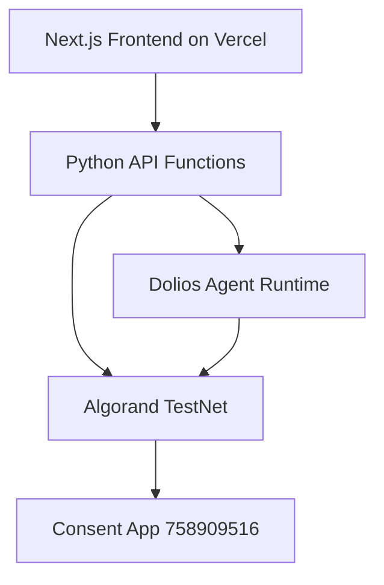

# Verified TestNet Deployment State

Last verified: 2026-04-16

## 1. Deployed Smart Contract

| Field | Value |
| --- | --- |
| Network | Algorand TestNet |
| App ID | `758909516` |
| App Address | `MBC3GSLWOUXTW7EPC4X5AOA2WFSLUEGLNKHHMQ3YEM3SZ4QF2OIXXBI2YE` |
| Creator / Registrar | `SHYFV65OX2KCXPFBKZBZNSYL6RE4PFAWHVWL2RIAR4QMULX7FS3NJJ7CFU` |
| Deploy Txid | `37V5ZNDZ4EJUNPJCVQEEUEGBTKWNFGWK5NWLVTGKSJ62SR6PHI5A` |
| Algod Endpoint | `https://testnet-api.algonode.cloud` |
| Indexer Endpoint | `https://testnet-idx.algonode.cloud` |

## 2. Explorer Links

- App: `https://lora.algokit.io/testnet/application/758909516`
- Txid: `https://lora.algokit.io/testnet/transaction/37V5ZNDZ4EJUNPJCVQEEUEGBTKWNFGWK5NWLVTGKSJ62SR6PHI5A`
- Creator account: `https://lora.algokit.io/testnet/account/SHYFV65OX2KCXPFBKZBZNSYL6RE4PFAWHVWL2RIAR4QMULX7FS3NJJ7CFU`

## 3. Contract Functionality

Contract methods currently deployed:

| Method | Signature | Purpose |
| --- | --- | --- |
| `register_consent` | `register_consent(byte[],byte[],byte[],byte[],uint64)void` | Writes or updates consent record in app box storage after attestation checks |
| `revoke_consent` | `revoke_consent(byte[],byte[])void` | Deletes consent box record for user-enterprise pair |
| `check_status` | `check_status(byte[],byte[])(bool,uint64)` | Returns active/expired state and expiry timestamp |

Data model:

- Box key derivation:
  - `SHA256(user_pubkey + enterprise_pubkey + app_id.to_bytes(8, "big"))`
- Box value schema (64 bytes):
  - `[0:32]` consent hash
  - `[32:40]` expiry timestamp (`uint64`)
  - `[40:41]` version byte
  - `[41:64]` reserved

## 4. On-Chain Consent State Snapshot

At the time of verification, the app contained multiple consent boxes with mixed status (`ACTIVE`, `EXPIRED`).

Example status view:

| Box Key (truncated) | Expiry | Status |
| --- | --- | --- |
| `2d1b0ab594de5ded...` | `1776354395` | ACTIVE |
| `287354147de6277b...` | `1776354211` | ACTIVE |
| `728dd8f96787c6cb...` | `1776350324` | EXPIRED |

## 5. Runtime Topology



Text alternative:
- Frontend invokes API routes on Vercel.
- API and agent runtime both interact with Algorand TestNet.
- Consent state is persisted in the deployed app's box storage.

## 6. Verification Commands

Check app existence:

```bash
python3 -c "
from algosdk.v2client.algod import AlgodClient
c = AlgodClient('', 'https://testnet-api.algonode.cloud')
print(c.application_info(758909516))
"
```

Check box inventory:

```bash
python3 -c "
from algosdk.v2client.algod import AlgodClient
c = AlgodClient('', 'https://testnet-api.algonode.cloud')
print(c.application_boxes(758909516))
"
```

Check deploy metadata from local artifact:

```bash
jq . contracts/artifacts/deployment-result.json
```

## 7. Vercel Runtime Integration Notes

To use this exact deployed app in runtime:

- Set `SHUNYAK_APP_ID=758909516`
- Ensure registrar and signer mnemonics are funded and configured
- Keep `SHUNYAK_ENABLE_TESTNET_TX=true`
- Validate `/api/algorand/showcase` output before demo run

## 8. Change Control for Future Deployments

When a new app is deployed:

1. Update `contracts/artifacts/deployment-result.json`.
2. Update this document's contract snapshot and explorer links.
3. Update runtime environment (`SHUNYAK_APP_ID`) in Vercel.
4. Re-run smoke checks in `docs/deployment.md`.
